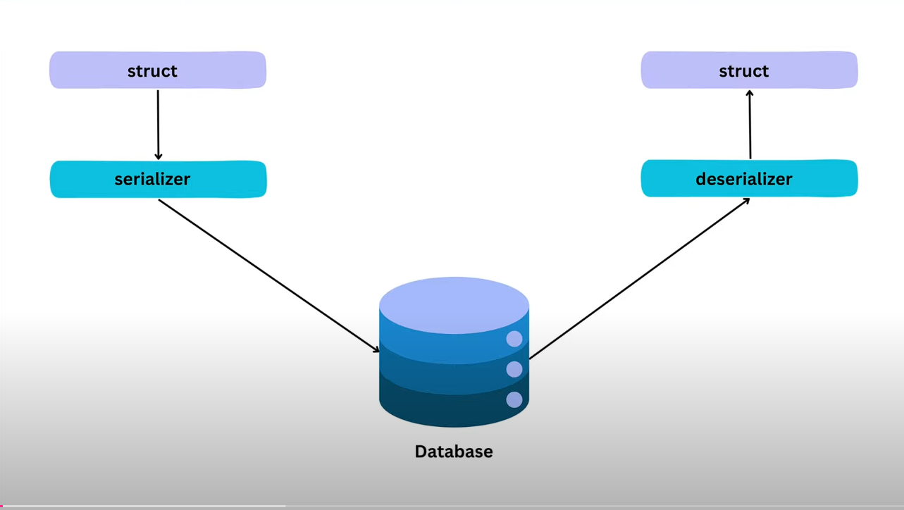

# Тестовый проект Gorm

## Отношения "Один к одному" и "Один ко многим"
Ассоциации

## Отношения "Многие ко многим"
Автоматическое создание таблицы связей
 
## Gorm Scopes
Переиспользование запросов (в виде отдельных функций)

## Gorm Hooks
Официальная документация: [Gorm Hooks](https://gorm.io/docs/hooks)

Hooks - это функции, вызываемые до или после создания, обновления, запроса или удаления данных.

Hooks позволяют: 
- внедрять различную логику в жизненном цикле операций с БД;
- выполнять код до или после действия над записями БД (операции CRUD);
- настроить поведение таких задач, как:
  - проверка корректности введенных значений;
  - ведение журнала (logging);
  - контроль доступа.

## Сериализация

### Какие бывают сериализаторы:
1. Protobuf
2. MessagePack
3. Gob

### Где действительно оправдано использование Protobuf?
Оправдано использовать в MSA с большим технологическим и языковым зоопарком, требующим сквозную стандартизацию.

### Когда MessagePack рациональнее Protobuf?
Так как MessagePack поставляется как отдельные пакеты для разных языков программирования, его использование оправдано, когда архитектура содержит минимальное число отличных друг от друга технологических стеков.

Почему так? Описание структуры данных делается индивидуально в каждом языке программирования для конкретного пакета, который реализует данную сериализацию. Изменение в одном сервисе, если оно нарушает обратную совместимость, потребует доработки всех связанных с ним сервисов.

Конечно и в случае с Protobuf потребуется сделать те же изменения, но, так как потребуется изменить лишь схему, а после её предкомпилировать под нужные языки, то работы потребуется значительно меньше.

### Когда стоит смотреть на Gob?
На текущий момент использование Gob оправдано в архитектуре, где работают сервисы, написанные только на Golang. Так как поддержка данной сериализации в других языках осуществляется только энтузиастами и актуализация пакетов может идти со значительной задержкой.

Почему стоит:
  - Это нативный сериализатор, не требующий никаких внешних зависимостей;
  - Операции производятся над теми же структурами, которые могут использоваться в логике приложения, без необходимости как-то преобразовывать структуры/данные, как это необходимо в случае с Protobuf и некоторыми реализациями MessagePack;
  - Этот формат позволяет работать с ним в потоке, без необходимости разделения сообщений добавлением границ для сообщений;
  - Когда хочется иметь функциональность, которая позволит преобразовывать поля в момент сериализации/десериализации благодаря интерфейсам GobEncoder и GobDecoder.

### Очевидные недостатки Protobuf
  - Необходимость предкомпиляции в структуры конкретного языка программирования;
  - Разработчику сложно расширять предкомпилированные структуры. Например, для добавления тегов, которые значительно увеличивают гибкость обработки и проверки данных из структур. Нужно настраивать и использовать дополнительные плагины (технически решаемая задача, но доставляет неудобства);
  - Необходимо писать конверторы ошибок, если требуется пробросить их в журнал или в сервис с другим форматом/структурой;
  - Поддерживает не все типы Golang;
  - Если вы используете язык программирования высокого уровня (Java, C#, Kotlin, Swift), у которого есть такие типы данных как decimal32/decimal64/decimal128, то воспользоваться этими типами в Protobuf не сможете, так как эти данные не поддерживаются, и придётся использовать Protobuf суррогаты, которые более ресурсозатратные.

### Практические недостатки MessagePack
  - Для одного языка программирования существует множество пакетов, каждый из которых имеет свою реализацию и свой интерфейс. Поэтому в рамках сервисов, реализованных на одном языке программирования, можно столкнуться с переносимыми с проекта на проект структурами. Это может быть особенно критично, когда сервисы разрабатываются разными командами без стандартизации процесса разработки.
  - Сложно обеспечивать лёгкую переносимость структур без стандартизации используемых пакетов в разработке. Тут не работает идея о том, что написал схему один раз и предкомпилируешь под каждый сервис отдельно, придётся поработать руками.
  - Не поддерживает все типы, доступные в Golang.
  - Работа с decimal типами здесь реализована простой конвертацией в строку и парсингом обратно – с точки зрения ресурсозатратности тоже очень сомнительное решение.

### Специфика работы с Gob
  - Для передачи типов в структурах, которые реализуют интерфейсы, должны быть предварительно зарегистрированы. Казалось, что это небольшая сложность и легко выполнимое правило, но на практике часто доставляет много неудобств, когда ведётся командная разработка, и когда один из разработчиков, написав интерфейс к структуре, не обратил внимание на то, что она используется в обмене данными.
  - Так как в Golang типа decimal нет, то в Gob задача передачи подобных данных решена по аналогии с MessagePack – простой конвертаций в строчку и парсингом обратно.